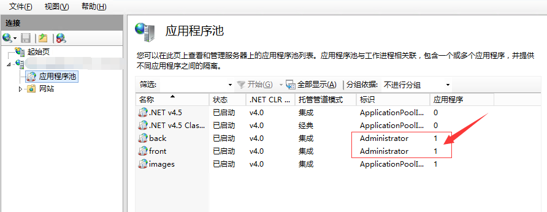
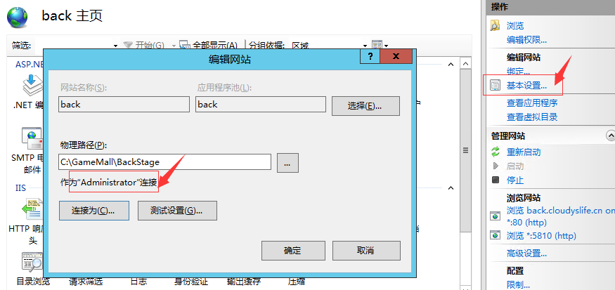
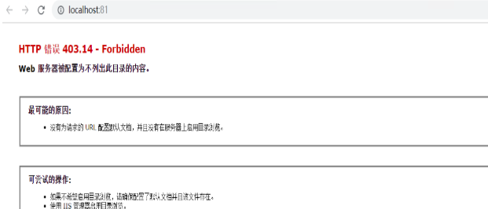
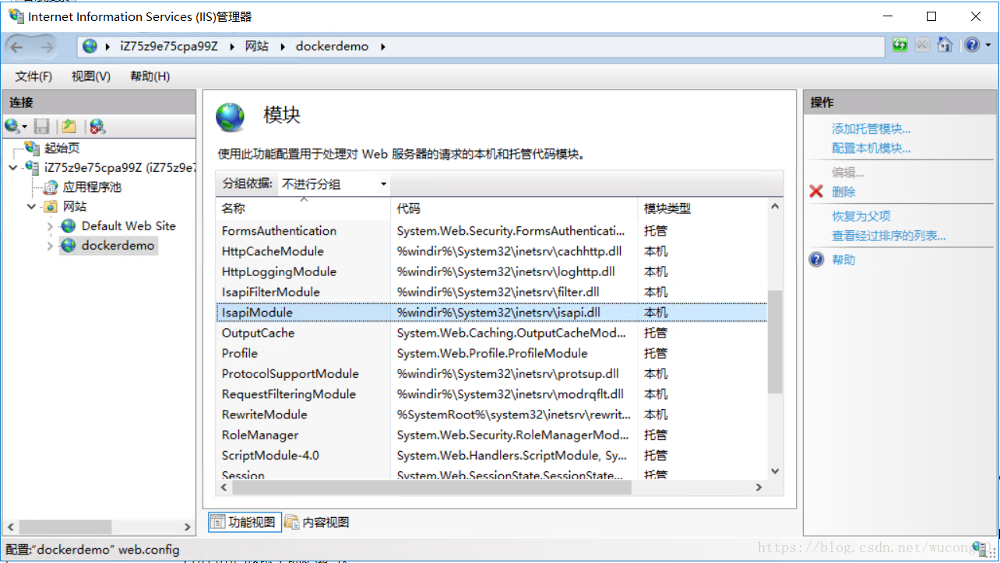
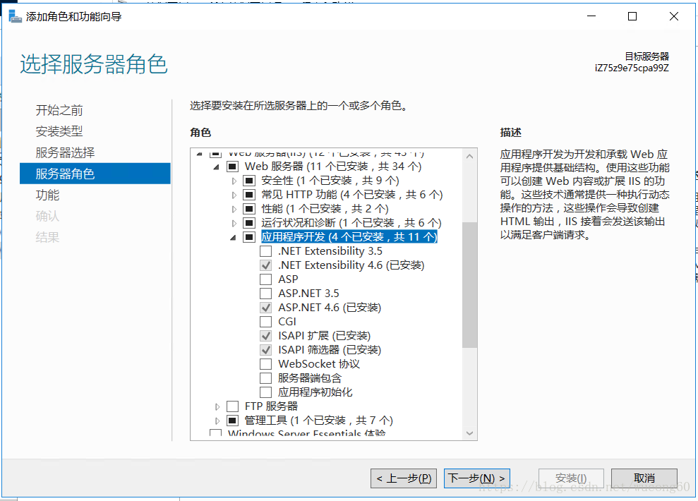

# GameMall

基于游戏的电商平台

## V1.0

## V2.0

### 预览

- 前台地址：http://123.207.242.177:6325/ 或 http://front.cloudyslife.cn/
- 后台地址：http://123.207.242.177:5810/ 或 http://back.cloudyslife.cn

### 运行

1. 运行sql
2. 使用iis，部署images服务器。端口8000
3. 前台端口：6325
4. 后台端口：5810
5. 数据库里面，图片路径为http://123.207.242.177:8000/，所以图片服务器必须为123.207.242.177:8000

### 部署

1. 前台：GameMall_V2.0/Release/GameMall/FrontStage
2. 后台：GameMall_V2.0/Release/GameMall/BackStage
3. 图片：GameMall_V2.0/Release/GameMall/BackStage/Images/Goods

几处需要Administrator权限的配置

### 常见错误

1. IIS部署错误： 403.14-Forbidden Web 服务器被配置为不列出此目录的内容
    https://blog.csdn.net/wucong60/article/details/83024778

部署你的dotnet程序到IIS的时候，经常会遇到如下错误

如果你按它上面的提示把目录浏览开启的话，那就too yong, too naive，开启目录浏览会直接显示文件的目录。

一般情况下，IIS接受到请求后，如果是静态的文件，比如html, css,javascript文件，它会直接请求文件，前将返回的结果返回给客户端，那如果不是静态文件呢，比如：asp, aspx, php等请求呢，这时候IIS会把请求交给对应扩展API模块来处理。接管.net 者asp.net mvc请求扩展API的名字叫isapi, 所以先得检查一下这个Module有没有，如下：

 如果上面这个模块没有的话，那需要到：控制面板-》启用或关闭Window功能=》Web服务器（IIS）中启用ASP.NET 4.6、ISAPI扩展，如下图：

安装成功之后，再来看看那个模块(Module)中有没有isapi，如果有的话，那网站就可以正常打开了。如果还打不开，可以采用以下办法。

（1）打开IIS的”处理程序映射设置“，在右边的操作栏下有 ”添加脚本映射“

请求路径：*

可执行文件：C:\Windows\Microsoft.NET\Framework\v4.0.30319\aspnet_isapi.dll
（2）改配置文件web.config配置文件的配置节点

~~~xml
<system.webServer>
    <validation validateIntegratedModeConfiguration="false" />
    <modules runAllManagedModulesForAllRequests="true" />
        <directoryBrowse enabled="false" />
  </system.webServer>
~~~

要设置<modules>节的值为true, 而目录浏览启用或禁用其实都没影响的。